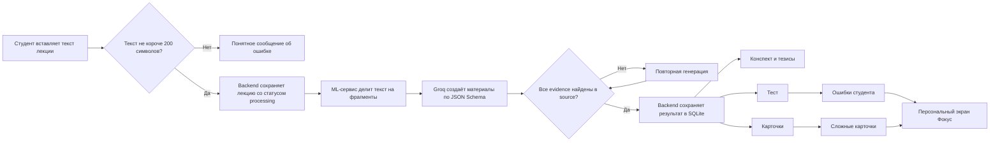
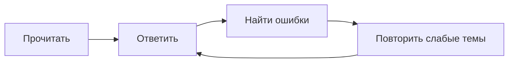
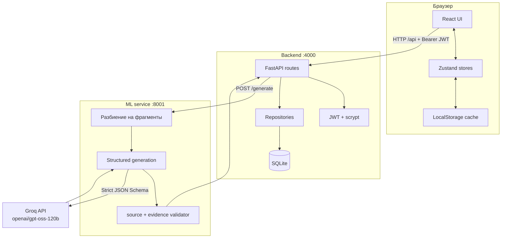
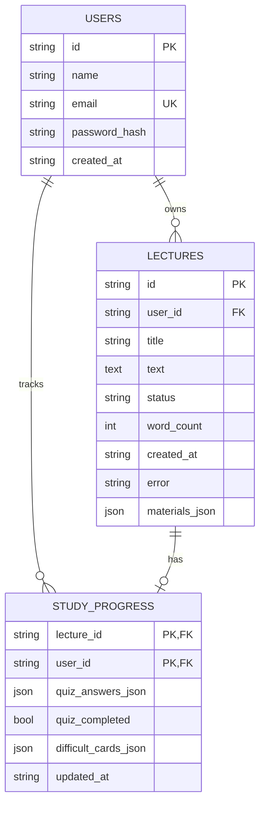

# Lectora — AI-помощник для подготовки по лекциям

> Рабочий веб-прототип для HackAlem AI: превращает текст лекции в конспект, тезисы, тест и карточки, проверяет опору результата на исходный текст и строит персональный маршрут повторения.

## Содержание

- [О проекте](#о-проекте)
- [Что реализовано](#что-реализовано)
- [Как работает решение](#как-работает-решение)
- [Ключевая особенность](#ключевая-особенность-маршрут-до-понимания)
- [Достоверность материалов](#достоверность-материалов)
- [Технологии](#технологии)
- [Архитектура](#архитектура)
- [Структура репозитория](#структура-репозитория)
- [Установка и запуск](#установка-и-запуск)
- [Как проверить решение](#как-проверить-решение)
- [API](#api)
- [Данные и интеграции](#данные-и-интеграции)
- [Тестирование](#тестирование)
- [Ограничения](#ограничения)
- [Развёртывание](#развёртывание)
- [Контакты](#контакты)

## О проекте

После лекции студенту приходится повторно просматривать запись или разбирать длинную расшифровку, вручную выделять главное, придумывать вопросы для самопроверки и создавать карточки. Это занимает время и не гарантирует, что важные темы будут замечены.

**Lectora** принимает текст одной лекции и формирует по нему комплект материалов для подготовки:

1. структурированный конспект;
2. список основных тезисов;
3. тест с вариантами и объяснениями ответов;
4. карточки для активного повторения;
5. персональный экран слабых тем на основе действий студента.

Основной пользователь — студент, который готовится к занятию, зачёту или экзамену. Результаты создаются после реальной обработки введённого текста, а не подменяются заранее подготовленными изображениями.

## Что реализовано

### Основной сценарий

- регистрация и вход по email и паролю;
- проверка JWT-сессии при открытии приложения;
- автоматический выход при истёкшей или недействительной сессии;
- ввод названия и текста лекции через интерфейс;
- проверка минимальной длины текста;
- состояния обработки и понятное сообщение об ошибке;
- повторный запуск неудачной обработки;
- генерация конспекта, тезисов, теста и карточек через Groq;
- просмотр исходного текста лекции;
- история материалов пользователя;
- удаление лекции с подтверждением;
- сохранение пользователей, лекций, результатов и прогресса в SQLite.

### Учебные возможности

- интерактивный тест с одним правильным ответом;
- объяснение после выбора ответа;
- сохранение ответов и статуса завершения теста;
- повторное прохождение теста;
- переворачиваемые карточки;
- отметки «Сложно» и «Знаю»;
- сохранение сложных карточек;
- восстановление прогресса после повторного входа;
- вкладка **«Фокус»** с ошибками, сложными карточками и индексом усвоения.

### Интерфейс

- публичный лендинг продукта;
- отдельные страницы входа и регистрации;
- адаптивный layout для desktop, tablet и mobile;
- нижняя мобильная навигация;
- доступные focus-состояния;
- микроанимации интерфейса;
- поддержка системной настройки `prefers-reduced-motion`;
- состояния пустой истории, загрузки, ошибки и готового результата.

## Как работает решение



Пользовательский путь:

1. Пользователь создаёт аккаунт или входит в существующий.
2. На странице новой лекции вставляет текст длиной от 200 символов.
3. Frontend создаёт локальный идентификатор лекции и отправляет текст в защищённый backend endpoint.
4. Backend сохраняет лекцию в SQLite и передаёт текст отдельному ML-сервису.
5. ML-сервис разбивает лекцию на пронумерованные фрагменты и запрашивает у Groq структурированный результат.
6. Каждая единица материала возвращается с `source` и дословной `evidence`.
7. ML-сервис проверяет цитаты; неподтверждённый ответ не принимается.
8. Готовые материалы сохраняются в SQLite и отображаются во frontend.
9. Ответы теста и сложные карточки сохраняются в backend.
10. Экран «Фокус» строит персональный маршрут повторения.

## Ключевая особенность: «Маршрут до понимания»

Большинство генераторов заканчивают работу после выдачи конспекта. Lectora использует дальнейшие действия студента:

- фиксирует неправильные ответы;
- запоминает карточки, отмеченные как сложные;
- рассчитывает комбинированный показатель усвоения;
- собирает слабые темы в последовательный план;
- показывает объяснение, исходный фрагмент и подтверждающую цитату.

Это превращает статичный набор AI-материалов в цикл обучения:



## Достоверность материалов

Одна только инструкция модели «не выдумывать» недостаточна, поэтому используется проверяемый контракт.

Каждый раздел конспекта, тезис, вопрос и карточка содержит:

- `source` — ссылку вида `Фрагмент N`;
- `evidence` — короткую дословную цитату из этого фрагмента.

ML-сервис нормализует цитату и исходный фрагмент, проверяет существование номера фрагмента и точное вхождение `evidence`. При ошибке выполняется повторная генерация. Если вторая попытка также не проходит проверку, пользователь получает ошибку вместо неподтверждённых материалов.

Проверка гарантирует наличие текстовой опоры в лекции. Она не является полной семантической верификацией истинности — это отражено в [ограничениях](#ограничения).

## Технологии

| Слой | Технологии |
|---|---|
| Frontend | JavaScript, React 19, Create React App / `react-scripts`, React Router 7, Zustand 5 |
| Стили | Tailwind CSS 4 через официальный CLI, CSS animations, Lucide React |
| Backend | Python, FastAPI, Uvicorn, Pydantic, HTTPX |
| Авторизация | JWT через PyJWT, пароли через `hashlib.scrypt`, Bearer Authentication |
| Хранилище | SQLite из стандартной библиотеки Python |
| ML-сервис | Python, FastAPI, Groq Python SDK |
| AI-модель | `openai/gpt-oss-120b` через Groq API |
| Контракт AI | Strict JSON Schema + повторная Pydantic-валидация |
| Тесты | Pytest, FastAPI TestClient, frontend production build |

Vite не используется. Frontend создан и собирается через Create React App, как предусмотрено требованиями команды.

## Архитектура



### Границы компонентов

- `frontend/` не знает и не хранит ключ Groq.
- `backend/` отвечает за пользователей, права доступа, историю, результаты и прогресс.
- `ml/` отвечает только за подготовку текста, вызов модели, схему ответа и grounding-проверку.
- Groq доступен только ML-сервису.

### Модель данных



## Структура репозитория

```text
.
├── frontend/                   # Create React App
│   ├── public/
│   └── src/
│       ├── app/                # Маршрутизация
│       ├── features/           # Auth, landing, lecture, quiz, cards, materials
│       ├── mocks/              # Демо-данные для mock-режима
│       ├── pages/              # Страницы приложения
│       ├── services/           # HTTP-адаптеры
│       ├── shared/             # UI-примитивы и layout
│       └── store/              # Zustand stores
├── backend/
│   ├── app/
│   │   ├── api/                # Auth и lecture endpoints
│   │   ├── core/               # Конфигурация, SQLite, security
│   │   ├── schemas/            # Pydantic DTO
│   │   └── services/           # Репозитории и ML client
│   ├── scripts/seed.py
│   └── tests/
├── ml/
│   ├── app/
│   │   ├── api/                # /generate
│   │   ├── schemas/            # Строгая схема материалов
│   │   └── services/           # Chunking, Groq, grounding
│   └── tests/
├── .env.example
└── README.md
```

Подробности каждого сервиса:

- [Frontend README](frontend/README.md)
- [Backend README](backend/README.md)
- [ML README](ml/README.md)

## Установка и запуск

### 1. Требования

- Node.js и npm, совместимые с `react-scripts@5`;
- Python 3.11 или новее;
- действующий Groq API key;
- три свободных порта: `3000`, `4000`, `8001`.

### 2. Получение репозитория

```bash
git clone <repository-url>
cd hack-a36bce32-itshechka
```

### 3. Конфигурация backend

Создайте `.env` в корне проекта на основе `.env.example`:

```bash
cp .env.example .env
```

Минимальная конфигурация:

```env
PORT=4000
CLIENT_ORIGIN=http://localhost:3000
JWT_SECRET=replace-with-a-long-random-string
JWT_EXPIRES_MINUTES=10080
ML_SERVICE_URL=http://localhost:8001
DATABASE_PATH=backend/data/app.db
```

Замените `JWT_SECRET` на длинное случайное значение перед публичным запуском.

### 4. Конфигурация ML

```bash
cp ml/.env.example ml/.env
```

Укажите новый Groq API key:

```env
GROQ_API_KEY=your-groq-key
GROQ_MODEL=openai/gpt-oss-120b
GROQ_TIMEOUT_SECONDS=90
```

Не добавляйте `ml/.env` в Git. Файл уже исключён через `.gitignore`.

### 5. Конфигурация frontend

```bash
cp frontend/.env.example frontend/.env
```

Для реальной генерации:

```env
REACT_APP_API_URL=http://localhost:4000/api
REACT_APP_USE_MOCK_API=false
```

Значение `true` включает демонстрационные данные без вызова ML-сервиса.

### 6. Установка backend

```bash
cd backend
python3 -m venv .venv
source .venv/bin/activate
pip install -r requirements.txt
python -m scripts.seed
cd ..
```

На Windows активация окружения выполняется командой:

```powershell
backend\.venv\Scripts\activate
```

### 7. Установка ML-сервиса

```bash
cd ml
python3 -m venv .venv
source .venv/bin/activate
pip install -r requirements.txt
cd ..
```

### 8. Установка frontend

```bash
cd frontend
npm install
cd ..
```

### 9. Запуск

Откройте три терминала.

Терминал 1 — ML:

```bash
cd ml
source .venv/bin/activate
uvicorn app.main:app --reload --port 8001
```

Терминал 2 — backend:

```bash
cd backend
source .venv/bin/activate
uvicorn app.main:app --reload --port 4000
```

Терминал 3 — frontend:

```bash
cd frontend
npm start
```

После запуска:

| Компонент | Адрес |
|---|---|
| Frontend | `http://localhost:3000` |
| Backend API | `http://localhost:4000/api` |
| Backend Swagger | `http://localhost:4000/docs` |
| ML API | `http://localhost:8001` |
| ML Swagger | `http://localhost:8001/docs` |

## Как проверить решение

### Готовый тестовый аккаунт

Seed-команда создаёт или обновляет пользователя:

```text
Email: demo@lectora.kz
Пароль: Demo1234!
```

Повторный запуск seed:

```bash
cd backend
source .venv/bin/activate
python -m scripts.seed
```

### Демонстрационный сценарий для жюри

1. Открыть `http://localhost:3000` и показать публичный лендинг.
2. Нажать «Войти» и использовать тестовый аккаунт либо зарегистрировать новый.
3. Открыть «Новая лекция».
4. Вставить выбранную расшифровку длиной более 200 символов.
5. Нажать «Создать материалы» и показать состояние обработки.
6. Открыть полученный конспект и тезисы.
7. Нажать «Исходный текст» и сопоставить материал с лекцией.
8. Пройти тест, намеренно допустив минимум одну ошибку.
9. Открыть карточки и отметить минимум одну карточку как сложную.
10. Перейти во вкладку «Фокус».
11. Показать индекс усвоения, ошибочные вопросы, сложные карточки и подтверждающие цитаты.
12. Выйти и войти повторно — лекция и прогресс сохранятся в SQLite.

### Проверка ошибок

- отправить пустой или короткий текст — frontend покажет понятное сообщение;
- остановить ML-сервис и запустить обработку — появится ошибка и кнопка повторной попытки;
- открыть защищённый маршрут без JWT — приложение перенаправит на вход;
- использовать истёкший JWT — frontend очистит сессию при ответе `401`.

## API

Все backend endpoints, кроме healthcheck и регистрации/входа, используют Bearer JWT.

| Метод | Endpoint | Назначение | Авторизация |
|---|---|---|---|
| `GET` | `/api/health` | Проверка backend | Нет |
| `POST` | `/api/auth/register` | Регистрация | Нет |
| `POST` | `/api/auth/login` | Вход | Нет |
| `GET` | `/api/auth/me` | Проверка сессии и профиль | Да |
| `GET` | `/api/lectures` | История лекций пользователя | Да |
| `GET` | `/api/lectures/{id}` | Одна лекция с материалами | Да |
| `POST` | `/api/lectures/{id}/process` | Сохранение и AI-обработка | Да |
| `DELETE` | `/api/lectures/{id}` | Удаление лекции | Да |
| `GET` | `/api/lectures/{id}/progress` | Получение учебного прогресса | Да |
| `PUT` | `/api/lectures/{id}/progress` | Сохранение учебного прогресса | Да |
| `GET` | `http://localhost:8001/health` | Проверка ML-сервиса | Внутренний сервис |
| `POST` | `http://localhost:8001/generate` | Генерация материалов | Внутренний сервис |

Интерактивная документация с точными request/response schemas доступна в Swagger.

## Данные и интеграции

### Входные данные

- текст одной лекции, введённый пользователем;
- название лекции;
- ответы пользователя в тесте;
- идентификаторы карточек, отмеченных как сложные.

### Хранимые данные

SQLite хранит:

- аккаунты и хеши паролей;
- исходные тексты лекций;
- статус обработки и сообщение об ошибке;
- JSON с AI-материалами;
- ответы теста;
- статус завершения теста;
- сложные карточки.

### Внешние сервисы

Единственная обязательная внешняя интеграция для реальной генерации — Groq API. Используется модель `openai/gpt-oss-120b` в режиме строгого JSON Schema.

Поиск в интернете и внешние источники знаний во время генерации не используются. Содержательная основа результата — только введённая лекция.

## Тестирование

Backend:

```bash
cd backend
source .venv/bin/activate
pip install -r requirements-dev.txt
pytest -q
```

Проверяется регистрация, вход, JWT-профиль, healthcheck, обработка лекции, сохранение истории и прогресса.

ML:

```bash
cd ml
source .venv/bin/activate
pip install -r requirements-dev.txt
pytest -q
```

Проверяется разбиение текста, frontend-compatible JSON Schema и принятие/отклонение дословных evidence.

Frontend:

```bash
cd frontend
npm run build
```

Production-сборка компилирует Tailwind CSS v4 и затем запускает стандартный CRA build.

## Ограничения

- Распознавание аудио и видео не реализовано: входом является готовый текст.
- Чат по лекции и экспорт в PDF/Anki не реализованы.
- Реальная генерация требует работающий Groq API key, доступ к интернету и доступность выбранной модели.
- Длина лекции ограничена диапазоном от 200 до 120 000 символов.
- Генерация выполняется синхронным HTTP-сценарием; отдельная очередь фоновых задач отсутствует.
- SQLite подходит для прототипа и одного backend-инстанса. Для горизонтального production-развёртывания понадобится внешняя БД, например PostgreSQL.
- `evidence` подтверждает наличие цитаты в исходном тексте, но не заменяет полноценную экспертную оценку качества перефразирования.
- История и прогресс сохраняются на сервере, но frontend также использует localStorage как Zustand cache.
- Механизм восстановления пароля и подтверждение email не реализованы.
- Deployed-версия отсутствует.

## Развёртывание

Публичная deployed-версия на текущем этапе отсутствует. Проект полностью запускается локально по инструкции выше.

Для будущего deployment потребуются:

- frontend static hosting с SPA fallback;
- отдельный Python runtime для backend;
- отдельный Python runtime для ML-сервиса;
- секреты `JWT_SECRET` и `GROQ_API_KEY` в secret storage платформы;
- постоянный volume для SQLite либо переход на PostgreSQL;
- корректные `CLIENT_ORIGIN`, `REACT_APP_API_URL` и `ML_SERVICE_URL`.

## Контакты

Если возникнут вопросы по запуску или работе проекта:

- команда: **ITshechka**;
- Telegram: [@ArtemSogi](https://t.me/ArtemSogi).

---

<p align="center">Made by <strong>ITshechka</strong> for HackAlem AI</p>
