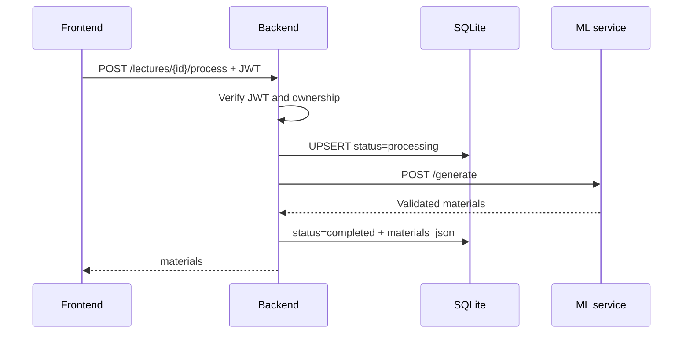

# Lectora Backend

[← Главный README](../README.md)

FastAPI-сервис, который отвечает за авторизацию, права доступа, SQLite-хранилище, историю лекций, результаты генерации и учебный прогресс. Backend является единственной точкой доступа frontend к ML-сервису.

## Стек

- Python 3.11+;
- FastAPI и Uvicorn;
- Pydantic;
- PyJWT;
- HTTPX;
- SQLite;
- `hashlib.scrypt` для паролей;
- Pytest и FastAPI TestClient.

## Запуск

Из корня проекта создайте `.env` на основе `.env.example`, затем:

```bash
cd backend
python3 -m venv .venv
source .venv/bin/activate
pip install -r requirements.txt
python -m scripts.seed
uvicorn app.main:app --reload --port 4000
```

Swagger: `http://localhost:4000/docs`.

## Конфигурация

Backend загружает `.env` из корня репозитория.

| Переменная | Default | Назначение |
|---|---|---|
| `CLIENT_ORIGIN` | `http://localhost:3000` | Разрешённый CORS origin |
| `JWT_SECRET` | development fallback | Подпись JWT; обязательно заменить публично |
| `JWT_EXPIRES_MINUTES` | `10080` | Срок жизни access token |
| `ML_SERVICE_URL` | `http://localhost:8001` | Адрес ML-сервиса |
| `DATABASE_PATH` | `backend/data/app.db` | SQLite-файл |

## Структура

```text
backend/
├── app/
│   ├── api/
│   │   ├── auth.py              # Register, login, me
│   │   └── lectures.py          # CRUD, process, progress
│   ├── core/
│   │   ├── config.py            # Environment
│   │   ├── database.py          # Schema и SQLite helper
│   │   └── security.py          # scrypt и JWT
│   ├── schemas/
│   │   ├── auth.py
│   │   └── lecture.py
│   ├── services/
│   │   ├── lecture_store.py
│   │   ├── ml_client.py
│   │   ├── progress_store.py
│   │   └── user_store.py
│   └── main.py
├── data/                         # app.db, исключён из Git
├── scripts/seed.py
├── tests/
├── requirements.txt
└── requirements-dev.txt
```

## API

| Метод | Endpoint | Request | Response |
|---|---|---|---|
| `GET` | `/api/health` | — | `{ "status": "ok" }` |
| `POST` | `/api/auth/register` | name, email, password | token + user |
| `POST` | `/api/auth/login` | email, password | token + user |
| `GET` | `/api/auth/me` | Bearer JWT | user |
| `GET` | `/api/lectures` | Bearer JWT | lectures[] |
| `GET` | `/api/lectures/{id}` | Bearer JWT | lecture + materials |
| `POST` | `/api/lectures/{id}/process` | title, text | materials |
| `DELETE` | `/api/lectures/{id}` | Bearer JWT | 204 |
| `GET` | `/api/lectures/{id}/progress` | Bearer JWT | progress |
| `PUT` | `/api/lectures/{id}/progress` | quizAnswers, quizCompleted, difficultCards | progress |

## Обработка лекции



Если ML-сервис возвращает ошибку, backend сохраняет `status=failed` и сообщение. Повторный запрос переводит лекцию обратно в `processing`.

## Безопасность

- пароли никогда не сохраняются открытым текстом;
- для хеширования используется `scrypt` с уникальной случайной солью;
- JWT подписываются алгоритмом HS256;
- защищённые endpoints используют HTTP Bearer;
- лекции и прогресс выбираются одновременно по `lecture_id` и `user_id`;
- конфликт идентификатора другого пользователя возвращает `409`;
- ML API key отсутствует в backend и frontend;
- CORS ограничен `CLIENT_ORIGIN`.

## SQLite

Schema создаётся автоматически при первом обращении.

Таблицы:

- `users`;
- `lectures`;
- `study_progress`.

Удаление лекции каскадно удаляет её прогресс. Удаление пользователя также предусмотрено внешними ключами, хотя отдельный endpoint удаления аккаунта пока отсутствует.

## Seed

```bash
python -m scripts.seed
```

Команда идемпотентно создаёт или обновляет:

```text
demo@lectora.kz
Demo1234!
```

## Тесты

```bash
pip install -r requirements-dev.txt
pytest -q
```

Тесты используют временные SQLite-файлы и не изменяют локальную базу разработки.

Покрытые сценарии:

- healthcheck;
- регистрация;
- вход;
- проверка `/auth/me`;
- защищённая обработка лекции с подменённым ML client;
- сохранение результата;
- получение истории;
- сохранение учебного прогресса.

## Ограничения backend

- нет refresh token и списка активных сессий;
- нет восстановления пароля и подтверждения email;
- SQLite рассчитан на один инстанс;
- генерация ожидается внутри HTTP-запроса, очередь задач отсутствует;
- нет endpoint импорта аудио/видео;
- порт задаётся параметром Uvicorn, переменная `PORT` автоматически не применяется командой запуска.
