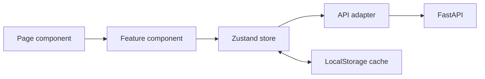

# Lectora Frontend

[← Главный README](../README.md)

Клиентская часть Lectora: публичный лендинг, авторизация и адаптивное учебное пространство для работы с конспектом, тезисами, тестом, карточками и персональным экраном «Фокус».

## Стек

- React 19;
- Create React App / `react-scripts@5`;
- React Router 7;
- Zustand 5 + persist middleware;
- Tailwind CSS 4 через `@tailwindcss/cli`;
- Lucide React;
- JavaScript и JSX.

Vite, Next.js и сторонняя компонентная библиотека не используются.

## Запуск

```bash
cp .env.example .env
npm install
npm start
```

Приложение откроется на `http://localhost:3000`.

Для production-сборки:

```bash
npm run build
```

Команда сначала компилирует Tailwind CSS, затем запускает CRA production build.

## Переменные окружения

```env
REACT_APP_API_URL=http://localhost:4000/api
REACT_APP_USE_MOCK_API=false
```

| Переменная | Назначение |
|---|---|
| `REACT_APP_API_URL` | Базовый адрес backend API |
| `REACT_APP_USE_MOCK_API` | `true` — локальные демо-материалы, `false` — реальный backend + ML |

После изменения `.env` перезапустите dev server.

## Маршруты

| Route | Экран | Доступ |
|---|---|---|
| `/` | Публичный лендинг | Публичный |
| `/login` | Вход | Публичный |
| `/register` | Регистрация | Публичный |
| `/app` | Новая лекция | JWT |
| `/history` | История материалов | JWT |
| `/profile` | Профиль | JWT |
| `/lectures/:lectureId/processing` | Обработка | JWT |
| `/lectures/:lectureId` | Конспект | JWT |
| `/lectures/:lectureId/key-points` | Тезисы | JWT |
| `/lectures/:lectureId/quiz` | Тест | JWT |
| `/lectures/:lectureId/flashcards` | Карточки | JWT |
| `/lectures/:lectureId/focus` | Персональный маршрут | JWT |

## Архитектура `src`

```text
src/
├── app/
│   └── App.jsx                    # Полная таблица маршрутов
├── features/
│   ├── auth/components/           # Формы, guard, bootstrap сессии
│   ├── flashcards/components/     # Колода и оценки сложности
│   ├── history/components/        # Строки истории
│   ├── landing/components/        # Секции публичной страницы
│   ├── lecture/components/        # Ввод и состояние обработки
│   ├── materials/components/      # Layout, вкладки, Фокус, источники
│   └── quiz/components/           # Интерактивный тест
├── mocks/
│   └── demoData.jsx               # Mock-контракт материалов
├── pages/                          # Композиция страниц
├── services/
│   ├── apiClient.jsx              # Fetch, Bearer JWT, обработка 401
│   └── lectureApi.jsx             # Backend/mock adapter
├── shared/
│   ├── layout/AppShell.jsx        # Desktop/mobile layout
│   └── ui/                        # Button, Card, dialogs, fields
├── store/
│   ├── authStore.jsx              # Сессия
│   ├── lectureStore.jsx           # Лекции и материалы
│   └── studyProgressStore.jsx     # Тест и сложные карточки
├── index.jsx
└── styles.css                     # Tailwind import, tokens, animations
```

## Поток состояния



### `authStore`

- хранит JWT и публичные данные пользователя;
- выполняет регистрацию и вход;
- вызывает `/auth/me` при старте;
- очищает сессию после `401`;
- не сохраняет пароли.

### `lectureStore`

- создаёт optimistic lecture object;
- запускает обработку;
- загружает историю с backend;
- хранит материалы по `lectureId`;
- удаляет лекции;
- использует localStorage как cache, а backend как источник серверных данных.

### `studyProgressStore`

- хранит ответы по идентификаторам вопросов;
- сохраняет завершение теста;
- хранит идентификаторы сложных карточек;
- синхронизирует прогресс через `PUT /lectures/:id/progress`;
- сохраняет локальную копию при временной сетевой ошибке.

## Контракт материалов

Frontend ожидает объект:

```json
{
  "summary": [
    {
      "title": "Название раздела",
      "text": "Краткое объяснение",
      "source": "Фрагмент 1",
      "evidence": "Дословная цитата из лекции"
    }
  ],
  "keyPoints": [
    {
      "id": 1,
      "text": "Основной тезис",
      "source": "Фрагмент 1",
      "evidence": "Дословная цитата"
    }
  ],
  "quiz": [
    {
      "id": 1,
      "question": "Вопрос",
      "options": ["A", "B", "C", "D"],
      "correctIndex": 0,
      "explanation": "Почему ответ правильный",
      "source": "Фрагмент 1",
      "evidence": "Дословная цитата"
    }
  ],
  "flashcards": [
    {
      "id": 1,
      "front": "Термин",
      "back": "Определение",
      "source": "Фрагмент 1",
      "evidence": "Дословная цитата"
    }
  ]
}
```

Этот же контракт используется mock-адаптером, поэтому UI можно разрабатывать без Groq.

## Авторизация

1. Zustand восстанавливает token из `hackalem-auth`.
2. `SessionBootstrap` вызывает `GET /auth/me`.
3. До завершения проверки защищённый маршрут показывает loader.
4. При успехе обновляются данные пользователя.
5. При `401` API client очищает сохранённый token и отправляет событие `auth:unauthorized`.
6. Stores лекций и прогресса очищаются при выходе.

## Адаптивность и UX

- desktop: постоянный sidebar;
- mobile/tablet: компактный header, нижняя навигация и дополнительный drawer;
- material tabs перестраиваются в сетку из пяти элементов;
- CTA и формы становятся полноширинными;
- длинные названия и email безопасно обрезаются или переносятся;
- диалоги используют overlay и мобильную высоту `100dvh`;
- анимации отключаются через `prefers-reduced-motion`;
- удаление требует подтверждения;
- после ошибки генерации доступна повторная попытка.

## Полезные команды

```bash
npm start                 # Tailwind watcher + CRA dev server
npm run tailwind:build    # Однократная сборка CSS
npm run tailwind:watch    # Наблюдение за Tailwind CSS
npm run build             # Production build
```

## Добавление новой страницы

1. Создайте страницу в `src/pages/*.jsx`.
2. Вынесите продуктовую логику в `src/features/<feature>/components`.
3. Переиспользуйте примитивы из `src/shared/ui`.
4. Добавьте route в `src/app/App.jsx`.
5. Если страница защищена, разместите её внутри `ProtectedRoute` и `AppShell`.

## Ограничения frontend

- автоматические component/E2E тесты пока не добавлены;
- localStorage является cache, а не защищённым хранилищем чувствительных данных;
- при `REACT_APP_USE_MOCK_API=true` история не синхронизируется с backend;
- deployment должен поддерживать SPA fallback на `index.html`.
