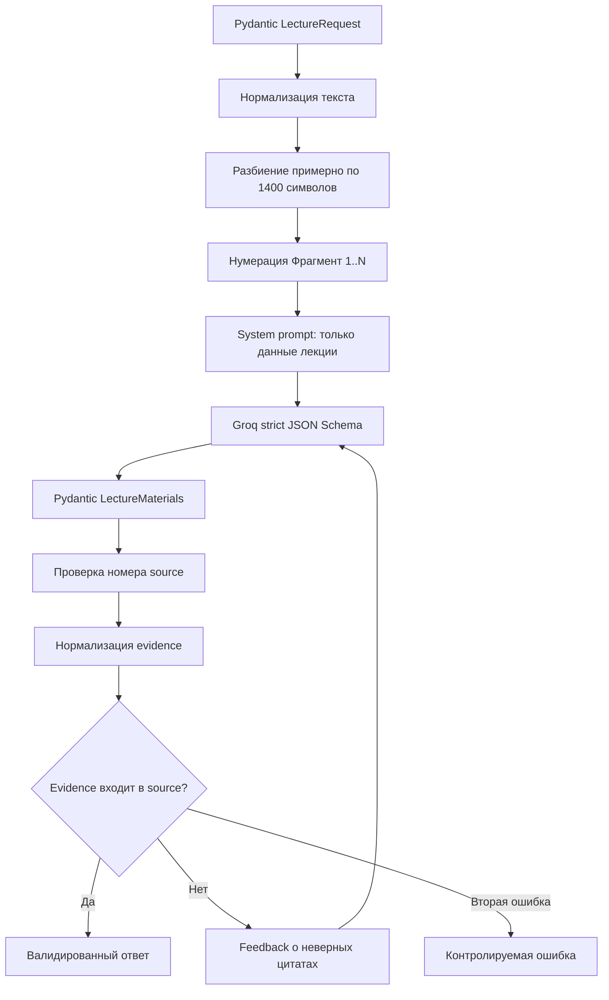

# Lectora ML Service

[← Главный README](../README.md)

Изолированный FastAPI-сервис, который принимает текст лекции, вызывает Groq в режиме строгого JSON Schema и проверяет, что каждый сгенерированный элемент содержит дословную опору в исходном фрагменте.

## Зачем сервис отделён

- ключ модели не попадает во frontend и основной backend;
- AI-провайдер и модель можно менять независимо;
- схема и grounding-проверка тестируются отдельно;
- backend работает только с уже валидированным контрактом материалов.

## Стек

- Python 3.11+;
- FastAPI и Uvicorn;
- Groq Python SDK;
- Pydantic;
- модель `openai/gpt-oss-120b`;
- Strict JSON Schema;
- Pytest.

## Запуск

```bash
cd ml
cp .env.example .env
# добавьте GROQ_API_KEY в .env
python3 -m venv .venv
source .venv/bin/activate
pip install -r requirements.txt
uvicorn app.main:app --reload --port 8001
```

Swagger: `http://localhost:8001/docs`.

## Переменные окружения

```env
GROQ_API_KEY=your-new-groq-key
GROQ_MODEL=openai/gpt-oss-120b
GROQ_TIMEOUT_SECONDS=90
```

| Переменная | Назначение |
|---|---|
| `GROQ_API_KEY` | Секретный ключ Groq; обязателен для генерации |
| `GROQ_MODEL` | Model ID, по умолчанию `openai/gpt-oss-120b` |
| `GROQ_TIMEOUT_SECONDS` | Timeout клиента Groq |

Файл `ml/.env` исключён из Git.

## API

### `GET /health`

Возвращает состояние сервиса, провайдера, model ID и признак наличия конфигурации. Значение ключа не возвращается.

Пример:

```json
{
  "status": "ok",
  "provider": "groq",
  "model": "openai/gpt-oss-120b",
  "configured": true
}
```

### `POST /generate`

Request:

```json
{
  "title": "Основы машинного обучения",
  "text": "Текст лекции длиной от 200 до 120000 символов"
}
```

Response:

```json
{
  "summary": [
    {
      "title": "Раздел",
      "text": "Краткое содержание",
      "source": "Фрагмент 1",
      "evidence": "Дословная цитата"
    }
  ],
  "keyPoints": [
    {
      "id": 1,
      "text": "Тезис",
      "source": "Фрагмент 1",
      "evidence": "Дословная цитата"
    }
  ],
  "quiz": [
    {
      "id": 1,
      "question": "Вопрос",
      "options": ["A", "B", "C", "D"],
      "correctIndex": 0,
      "explanation": "Объяснение",
      "source": "Фрагмент 1",
      "evidence": "Дословная цитата"
    }
  ],
  "flashcards": [
    {
      "id": 1,
      "front": "Термин",
      "back": "Определение",
      "source": "Фрагмент 1",
      "evidence": "Дословная цитата"
    }
  ]
}
```

## Pipeline



## Разбиение текста

`split_into_fragments`:

1. нормализует пробелы;
2. пытается разделить текст по абзацам;
3. если абзац один — разделяет по границам предложений;
4. объединяет части до целевого размера около 1400 символов;
5. сохраняет порядок исходной лекции.

Фрагменты передаются модели как:

```text
[Фрагмент 1]
...

[Фрагмент 2]
...
```

## Strict JSON Schema

Все response models наследуют `StrictModel`:

- лишние поля запрещены через `extra="forbid"`;
- все содержательные поля обязательны;
- frontend aliases `keyPoints` и `correctIndex` входят непосредственно в JSON Schema;
- ответ Groq дополнительно валидируется Pydantic после получения.

## Grounding-проверка

Для каждого элемента проверяется:

1. `source` соответствует формату `Фрагмент N`;
2. фрагмент с таким номером существует;
3. `evidence` содержит минимум три слова;
4. нормализованная цитата дословно входит в нормализованный исходный фрагмент.

Проверяются все четыре массива: `summary`, `keyPoints`, `quiz`, `flashcards`.

Если проверка не прошла, вторая попытка получает краткое описание ошибок. После двух неудачных попыток сервис возвращает контролируемую ошибку вместо сомнительного результата.

## Структура

```text
ml/
├── app/
│   ├── api/generate.py
│   ├── core/config.py
│   ├── schemas/materials.py
│   ├── services/
│   │   ├── chunking.py
│   │   ├── generator.py
│   │   └── grounding.py
│   └── main.py
├── tests/
│   ├── test_chunking.py
│   └── test_grounding.py
├── .env.example
├── requirements.txt
└── requirements-dev.txt
```

## Тесты

```bash
pip install -r requirements-dev.txt
pytest -q
```

Проверяются:

- разбиение длинного текста;
- нумерация фрагментов;
- наличие frontend aliases в JSON Schema;
- принятие реальной дословной цитаты;
- отклонение выдуманной цитаты.

Unit-тесты не обращаются к Groq и не требуют API key.

## Ограничения ML

- входом является текст, распознавание речи отсутствует;
- максимальная длина запроса — 120 000 символов;
- pipeline выполняет одну генерацию целого результата, а не map-reduce по очень большим документам;
- повторная попытка увеличивает latency и расход токенов;
- дословная evidence проверяет опору, но не гарантирует идеальное качество всех выводов;
- доступность генерации зависит от Groq API и выбранной модели;
- endpoint не имеет собственной авторизации и рассчитан на внутреннюю сеть между backend и ML.
